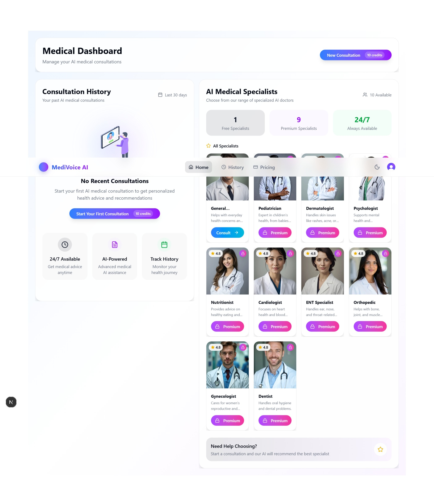

# 🏥 MediVoice AI

<div align="center">



**AI-Powered Medical Voice Assistant for Smart Healthcare Consultations**

[](https://nextjs.org/)
[](https://www.typescriptlang.org/)
[](https://tailwindcss.com/)
[](https://clerk.com/)

[](https://opensource.org/licenses/MIT)
[](https://github.com/NaingMinThant77/Next-AI-Medical-Agent)

</div>

---

## 🌟 Overview

**MediVoice AI** is a cutting-edge AI Medical Voice Agent built with Next.js that revolutionizes healthcare consultations. Users can describe their symptoms, get matched with specialized AI doctors, and conduct voice conversations for medical advice. After each consultation, users receive comprehensive medical reports in structured JSON format.

### ✨ Key Features

- 🤖 **AI-Powered Symptom Analysis**
- 🎙️ **Voice Conversation Support**
- 📋 **Detailed Medical Reports**
- 👥 **Multiple AI Medical Specialists**
- 💳 **Flexible Pricing Plans**
- 🔐 **Secure Authentication**
- 📱 **Responsive Design**

---

## 💎 Pricing Plans

### 🆓 Free Plan

- **1 AI Medical Doctor Agent**
- **10 Consultation Credits**
- Basic medical consultations
- Standard report generation

### 💎 Pro Plan - $9.99/month

- **10 Different AI Medical Doctor Agents** including:
  - General Physician AI
  - Cardiologist AI
  - Neurologist AI
  - Pediatrician AI
  - Dermatologist AI
  - Orthopedic AI
  - Psychiatrist AI
  - Gynecologist AI
  - ENT Specialist AI
  - Gastroenterologist AI
- **Unlimited Consultations**
- **Priority Support**
- **Advanced Report Features**
- **Voice Conversation History**

<div align="center">

**Upgrade to Pro for unlimited access to specialized medical AI assistants!**

</div>

---

## 📋 Medical Report Format

Each consultation generates a comprehensive medical report in JSON format:

```json
{
  "sessionId": "unique_session_identifier",
  "agent": "Medical_Specialist_AI",
  "user": "Patient_Name_or_Anonymous",
  "timestamp": "2024-03-19T10:42:00.000Z",
  "chiefComplaint": "Brief summary of main health concern",
  "summary": "2-3 sentence summary of consultation",
  "symptoms": ["symptom1", "symptom2", "symptom3"],
  "duration": "Duration of symptoms",
  "severity": "mild|moderate|severe",
  "medicationsMentioned": ["medication1", "medication2"],
  "recommendations": ["recommendation1", "recommendation2"]
}
```

### 📊 Report Fields Explained

| Field                  | Description                    | Type     |
| ---------------------- | ------------------------------ | -------- |
| `sessionId`            | Unique consultation identifier | `string` |
| `agent`                | AI medical specialist name     | `string` |
| `user`                 | Patient name or "Anonymous"    | `string` |
| `timestamp`            | Consultation date/time (ISO)   | `string` |
| `chiefComplaint`       | Main health concern summary    | `string` |
| `summary`              | Consultation overview          | `string` |
| `symptoms`             | List of reported symptoms      | `array`  |
| `duration`             | How long symptoms persisted    | `string` |
| `severity`             | Symptom severity level         | `string` |
| `medicationsMentioned` | Current medications            | `array`  |
| `recommendations`      | AI-generated advice            | `array`  |

---

## 🚀 Quick Start

### 📋 Prerequisites

- Node.js 18+
- npm or yarn package manager
- PostgreSQL database (NeonDB recommended)

### ⚙️ Installation

```bash
# Clone the repository
git clone https://github.com/NaingMinThant77/Next-AI-Medical-Agent.git
cd Next-AI-Medical-Agent

# Install dependencies
npm install

# Copy environment variables
cp .env.example .env.local

# Run the development server
npm run dev
```

### 🔧 Environment Setup

Configure your `.env.local` file with the following variables:

```bash
# Database
DATABASE_URL=your_postgresql_database_url

# Clerk Authentication
NEXT_PUBLIC_CLERK_PUBLISHABLE_KEY=your_clerk_publishable_key
CLERK_SECRET_KEY=your_clerk_secret_key

# OpenRouter API
OPEN_ROUTER_API_KEY=your_openrouter_api_key

# Vapi Voice Assistant
NEXT_PUBLIC_VAPI_VOICE_ASSISTANT_ID=your_vapi_assistant_id
NEXT_PUBLIC_VAPI_PUBLIC_KEY=your_vapi_public_key
```

🌐 **Open [http://localhost:3000](http://localhost:3000) to view the application**

---

## 🛠️ Tech Stack

<div align="center">

### 🎨 Frontend Technologies

[](https://nextjs.org/)
[](https://www.typescriptlang.org/)
[](https://tailwindcss.com/)
[](https://ui.shadcn.com/)

### 🎯 UI/UX Libraries

[](https://www.framer.com/motion/)
[](https://react-icons.github.io/react-icons/)
[](https://github.com/pacocoursey/next-themes)

### 🗄️ Backend & Database

[](https://orm.drizzle.team/)
[](https://www.postgresql.org/)
[](https://neon.tech/)

### 🔐 Authentication & APIs

[](https://clerk.com/)
[](https://openai.com/)
[](https://vapi.dev/)
[](https://www.assemblyai.com/)

</div>

### 📦 Core Dependencies

| Category             | Technologies               |
| -------------------- | -------------------------- |
| **Framework**        | Next.js 14+                |
| **Language**         | TypeScript                 |
| **Styling**          | Tailwind CSS + Shadcn UI   |
| **Database**         | Drizzle ORM + NeonDB       |
| **Authentication**   | Clerk                      |
| **AI/ML**            | OpenRouter (GPT-3.5-turbo) |
| **Voice**            | Vapi + AssemblyAI          |
| **State Management** | React Context API          |
| **HTTP Client**      | Axios                      |
| **Date/Time**        | Moment.js                  |
| **Animations**       | Framer Motion              |

---

## 🖼️ Project Showcase

### 🔐 Authentication Flow

<div align="center">

**Register & Login System**

</div>

**📝 Register Page**


**🔑 Login Page** (OAuth Google & Email support)


**🔐 Password Entry**


**✉️ Email Verification**


---

### 🆓 Free Version Features

<div align="center">

**Experience AI Medical Consultations with Basic Features**

</div>

**🏠 Home Dashboard**


**👤 User Profile Management**


**💳 Profile Model Tag**


**💳 Update Profile & Add New Email**


**💳 Update Password**


**💳 Billing & Subscription**


**🩺 Consultation Flow**


**🩺 Selected Doctor**


**🩺 Direct Consultation With Conduct Button in Doctor Lists**


**💬 AI Conversation Interface**


**💬 Talk With AI Medical Doctor Agent**


**📊 Medical Reports**


**📊 History Page With Data**


**📊 History Page with No Data Yet**


**📊 Pricing Page**


---

### 💎 Pro Version Features

<div align="center">

**Unlock Unlimited Access to Specialized Medical AI**

</div>

**💎 Buying Pro Version**


**💎 Pricing Page with Pro Active**


**💎 Billing Pro Version & Renew Date**


**💎 Billing Transaction**


**💎 Dashboard Home Page - Pro Version**


---
